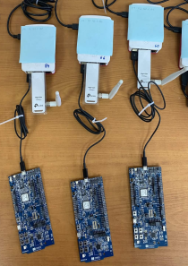
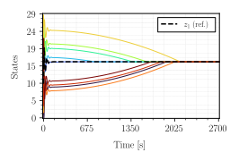
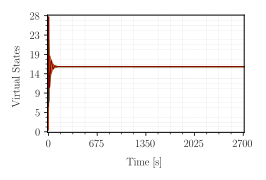
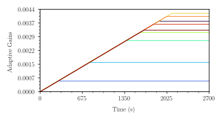

# 🧠 Practical Coordination Scheme Platform

This repository implements a **coordination algorithms** across a heterogeneous IoT network composed of **Raspberry Pi 4** devices and **Nordic nRF52-DK** boards.  
Communication between agents occurs through **Wi-Fi** and **Bluetooth Low Energy (BLE)** links.

---

## ⚙️ System Overview

<p align="center">
  
</p>

The project includes several coordinated components:

- **Node:**  
  A physical hardware unit composed of a Raspberry Pi connected via USB to an nRF52-DK board.

- **Edge-device:**  
  A logical process running inside a node.  
  Each node can host up to **three edge-devices**, one per communication type:
  - `ble` → BLE process (advertises and listens)
  - `wifi` → Wi-Fi process (HTTP client/server)
  - `bridge` → bridge process (links BLE and Wi-Fi subnetworks)

- **Router:**  
  Provides the local Wi-Fi LAN for inter-node communication.

- **Hub server:**  
  Runs on a laptop and is responsible for configuring network parameters, broadcasting experiment triggers, and coordinating all edge-devices.

- **User Interface (UI):**  
  A web dashboard available at `http://localhost:3000` on the same laptop as the hub server.  
  It allows configuring algorithms, launching experiments, and visualizing results.

---

## 🚀 Implementation Steps

### 1. Flash the nRF52-DK firmware

1. Build and flash the firmware located in  
   `/consensus/nordic`.  
   Use **Nordic SDK 2.7.0**.
2. Refer to the [Nordic DevAcademy courses](https://academy.nordicsemi.com/) for instructions on installing toolchains and flashing via nRF Connect or `nrfutil`.

---

### 2. Prepare the Raspberry Pi devices

1. Flash each SD card with **Raspbian Bookworm OS** and enable the **SSH server**.  
   Default credentials:
   ```bash
   username: ---
   password: ---
   ```
2. Install required packages:
   ```bash
   sudo apt update
   sudo apt install expect
   ```
3. Install Node Version Manager (NVM) and Node.js:
   ```bash
   # 1. One-time NVM install (this is what the "0.40.1" actually refers to — the NVM installer)
   curl -o- https://raw.githubusercontent.com/nvm-sh/nvm/v0.40.1/install.sh | bash

   # 2. Reload shell so the 'nvm' command becomes available in the current session
   export NVM_DIR="$HOME/.nvm"
   [ -s "$NVM_DIR/nvm.sh" ] && \. "$NVM_DIR/nvm.sh"

   # 3. Install Node.js
   nvm install 22.11.0
   nvm use 22.11.0
   nvm alias default 22.11.0    # make 22.11.0 the default in new shells
   ```
4. Connect to the LAN via Wi-Fi:
   ```bash
   sudo raspi-config
   ```
   Then verify and note the IP address:
   ```bash
   ip a
   ```

---

### 3. Move Wi-Fi to the TP-Link USB dongle (`wlan1`)

> **Why:** the onboard CYW43455 combines Wi-Fi and BLE on a single antenna and shares airtime between them via an on-chip coexistence arbiter. When the Wi-Fi half is active, BLE scanning and advertising are throttled — which directly affects how quickly each bridge sees its BLE neighbors' state. Moving Wi-Fi to a separate USB radio frees the onboard chip to handle BLE only.

1. Plug the **TP-Link 2.4 GHz USB dongle** into each Pi. It appears as `wlan1`.
2. Connect `wlan1` to the same LAN that `wlan0` was on:
   ```bash
   nmcli device wifi list ifname wlan1
   sudo nmcli device wifi connect "<SSID>" password "<PASSWORD>" ifname wlan1
   ```
3. Disable the onboard Wi-Fi at the firmware level (this is BLE-safe — only the Wi-Fi half of the CYW43455 is turned off):
   ```bash
   echo "dtoverlay=disable-wifi" | sudo tee -a /boot/firmware/config.txt
   sudo reboot
   ```
4. After reboot, verify:
   ```bash
   iw dev                          # should show only wlan0 (wlan1 binded to wlan0 as a default logic interface) 
   ethtool -i wlan0 | grep driver  # brcmfmac = onboard CYW43455; rtl8xxxu/8192cu/mt7601u = TP-Link
   hciconfig -a                    # should still show hci0 (BLE controller)
   ip -4 addr show wlan0
   ```
5. Note the new IP on `wlan0` — this is the address to use when filling in `TOPOLOGY` in step 9.


---

### 4. Configure clock synchronization (chrony)

> **Why:** every node stamps its state with `Date.now()` referenced to its own clock. Without sync, trajectories from different Pis won't line up when plotted together in *Data History*. Chrony with the hub as time server brings inter-node skew to well under 1 ms on a typical LAN — observed ~30–100 µs in practice.

The **hub laptop acts as the master clock**; each Pi syncs to it. Designating a single authoritative source keeps all nodes referenced to the same timeline and makes the experiment independent of internet availability.

> **Note on linuxptp:** PTP would give sub-100 µs sync on Ethernet but doesn't work reliably over USB Wi-Fi dongles whose drivers don't advertise software TX timestamping (very common — Realtek and Mediatek USB drivers all behave this way). Chrony over UDP works regardless of driver capability and is more than accurate enough for this use case.

#### 4.1. Configure the hub as the time server

Debian/Ubuntu. For macOS or Windows hubs, designate one Pi as the master instead by applying this section's commands to that Pi and pointing all clients there.

```bash
sudo apt install chrony

sudo tee -a /etc/chrony/chrony.conf >/dev/null <<'EOF'

# Serve time to the LAN
allow 192.168.0.0/24
local stratum 8
EOF

sudo systemctl restart chrony
```

The `local stratum 8` directive lets chrony serve time even if the hub has no internet upstream.

**Sanity check on the hub:**

```bash
grep -E '^(allow|local)' /etc/chrony/chrony.conf
sudo ss -ulnp | grep chrony
```

You should see the `allow` and `local` lines AND chrony listening on `0.0.0.0:123` (NTP service port). If you only see `127.0.0.1:323` (the command socket), the `allow` directive didn't apply — chrony is running as a client only and won't accept queries from the Pis.

If the hub has a firewall (ufw, firewalld), explicitly allow NTP from the LAN:

```bash
sudo ufw allow from 192.168.0.0/24 to any port 123 proto udp
```

Note the hub's LAN IP — you'll need it in the next step:

```bash
ip -4 addr show | grep inet
```

#### 4.2. Configure each Pi to sync to the hub

Substitute `<HUB_IP>` with the laptop's LAN IP from the previous step.

```bash
sudo apt install chrony

# Remove ALL existing pool/server lines from the main config and any included dirs.
# Bookworm's chrony also reads /etc/chrony/conf.d/ and /etc/chrony/sources.d/, plus
# /run/chrony-dhcp/ for NTP servers pushed by the router via DHCP option 42.
sudo sed -i -E '/^(pool|server)\s/d' /etc/chrony/chrony.conf
sudo find /etc/chrony/conf.d /etc/chrony/sources.d -type f \
    \( -name '*.conf' -o -name '*.sources' \) \
    -exec sudo sed -i -E '/^(pool|server)\s/d' {} \; 2>/dev/null

# Optional but recommended: stop chrony from ingesting router-supplied NTP servers
sudo sed -i '/^sourcedir \/run\/chrony-dhcp/d' /etc/chrony/chrony.conf

# Add the hub as the sole time source
echo "server <HUB_IP> iburst minpoll 1 maxpoll 4" | sudo tee -a /etc/chrony/chrony.conf

sudo systemctl restart chrony
```

`iburst` triggers fast initial sync; `minpoll 1 maxpoll 4` polls every 2–16 seconds for tighter tracking than the 64-second default.

#### 4.3. Verify all Pis are syncing to the hub

From the hub laptop, query all Pis at once:

```bash
for ip in 192.168.0.<pi1> 192.168.0.<pi2> 192.168.0.<pi3>; do
    echo "=== $ip ==="
    ssh control@$ip "chronyc tracking | grep -E 'Reference ID|Stratum|System time'"
done
```

Within ~30 seconds of restart, every Pi should report:

- `Reference ID` = the hub's IP in **hex** (e.g. `192.168.0.145` → `C0A80091`)
- `Stratum` = hub's stratum + 1 (typically 4 or 5)
- `System time` = microseconds, not nanoseconds-zero

**If `Reference ID` is `00000000` and `Stratum` is `0`:** that Pi hasn't selected a source. Most common cause is that step 4.2 was applied before the hub finished step 4.1 — `iburst` only fires once at chrony startup, so restart chrony on the affected Pis:

```bash
ssh control@<pi_ip> "sudo systemctl restart chrony"
```

**If the Reference ID is some other IP** (e.g., an external NTP server), the old pool/server lines weren't fully stripped. Re-check what's left:

```bash
ssh control@<pi_ip> 'grep -rE "^(pool|server)" /etc/chrony/'
```

The only `server` line should be the hub. If anything else appears, rerun the cleanup in step 4.2.

---

### 5. Deploy the Raspberry Pi code

1. Copy all files from `raspberry/` to each Raspberry Pi (omit `node_modules` and `package-lock.json`).  
2. Install dependencies:
   ```bash
   cd ~/Desktop/Finite-Time-Adaptive-Coordination/raspberry
   npm install
   ```
3. Ensure the script `bleadv.sh` is executable:
   ```bash
   chmod +x raspberry/bleadv.sh
   ```

---

### 6. Configure the laptop (hub host)

On your laptop:
- Clone or copy the repository to `~/Finite-Time-Adaptive-Coordination/raspberry`.
- Install Node.js and NVM (no need for `expect`).
- Ensure you are connected to the same router LAN as the Raspberry Pis.

---

### 7. Create the physical nodes

Attach each **nRF52-DK** board to a **Raspberry Pi** using a USB cable.  
Repeat for every node.  
You can SSH into each node using its IP address and credentials.

---

### 8. Run the edge-device processes

For each node:

1. Open **three terminal windows** and navigate to:
   ```bash
   cd ~/Finite-Time-Adaptive-Coordination/raspberry
   ```
2. Launch the edge-device processes:
   ```bash
   node back ble
   node back wifi
   node back bridge
   ```

---

### 9. Configure the network topology

Edit `~/Finite-Time-Adaptive-Coordination/raspberry/net.js` and modify the `TOPOLOGY` variable to match your desired topology.

Example (9-node dring):
```js
// Example topology
// ... ---> 4 ---> 1 ---> 9 ---> 5 ---> 2 ---> 6 ---> 8 ---> 3 ---> 7 ---> ...
```

---

### 10. Launch the hub server

1. On your laptop, open a new terminal:
   ```bash
   cd ~/Finite-Time-Adaptive-Coordination/raspberry
   node hub
   ```
2. Open a browser at [http://localhost:3000](http://localhost:3000).

**Tip:** Press the reset button on all nRF52-DK boards before starting new experiments to ensure a clean state.

In the UI:
- Enter a test name, enable the trigger, and click **Update Params**.

---

### 11. Observe and collect results

When the algorithm converges (visible in the UI), stop the test by unchecking the trigger box and clicking **Update Params**.  
Then go to **Data History → [your test name]** to view and analyze your results.

---

## 📊 Example Results

Using the following topology:

```js
// 9node-ring-dir: ... ---> 4 ---> 1 ---> 9 ---> 5 ---> 2 ---> 6 ---> 8 ---> 3 ---> 7 ---> ...

TOPOLOGY = [
  {id: 1, ip: '192.168.0.136', type: TYPE_BLE,    enabled: true, neighbors: [4], clock: 500},
  {id: 2, ip: '192.168.0.136', type: TYPE_WIFI,   enabled: true, neighbors: [5], clock: 500},
  {id: 3, ip: '192.168.0.136', type: TYPE_BRIDGE, enabled: true, neighbors: [8], clock: 500},
  {id: 4, ip: '192.168.0.101', type: TYPE_BLE,    enabled: true, neighbors: [7], clock: 500},
  {id: 5, ip: '192.168.0.101', type: TYPE_WIFI,   enabled: true, neighbors: [9], clock: 500},
  {id: 6, ip: '192.168.0.101', type: TYPE_BRIDGE, enabled: true, neighbors: [2], clock: 500},
  {id: 7, ip: '192.168.0.134', type: TYPE_BLE,    enabled: true, neighbors: [3], clock: 500},
  {id: 8, ip: '192.168.0.134', type: TYPE_WIFI,   enabled: true, neighbors: [6], clock: 500},
  {id: 9, ip: '192.168.0.134', type: TYPE_BRIDGE, enabled: true, neighbors: [1], clock: 500},
]; 
```

<p align="center">
  
  
  
</p>

---

## 🧩 Folder Structure

```
Finite-Time-Adaptive-Coordination/
├── nordic/          # nRF52 firmware source (Zephyr-based)
├── raspberry/       # Node.js applications for BLE, Wi-Fi, and bridge agents
└── docs/            # Documentation and topology examples
```

---

## 🧠 Credits

Developed as part of the **Time Synchronization and Finite-Time Consensus** project  
at the **Cyber-Physical Systems Laboratory**,  
**Pontificia Universidad Católica de Chile**.